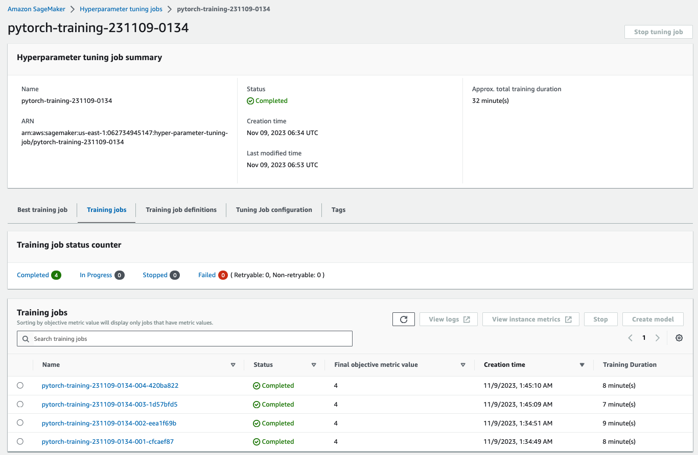
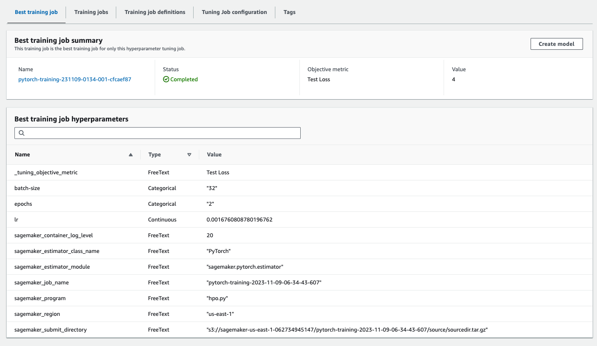
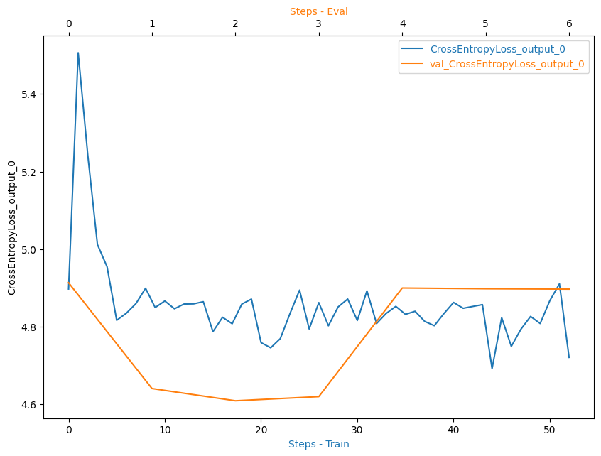
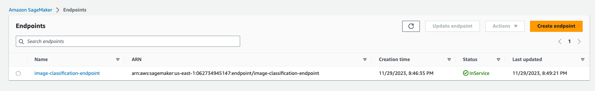
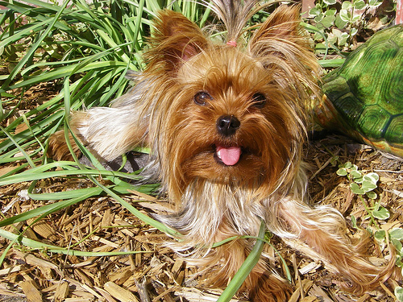

# Image Classification using AWS SageMaker

The goal of this project is to demonstrate how we can use a pretrained image classification model to classify the dog breed given an image of the dog.

## Project Set Up and Installation

This file is thought to be executed locally (using Sagemaker SDK).
You need to open the gateway and copy credentials provided.

### Steps to Set Up and run the project

- Install the AWS CLI in your terminal
- Configure a profile using the credentials provided with `aws configure --profile udacity-mle`
- Clone the repo using `git clone git@github.com:alejlatorre/aws-sagemaker-image-classification.git`
- Run the notebook cells to download the data, upload it to s3, launch the hyperparameter tuning job, launch the training job, display the debugging & profilling outputs & finally deployment and querying the model.

## Hyperparameter Tuning

I have choosen pretrained RESNET50 model, because it's suited for image classification tasks. Hyperparameter tuning was performed using `hpo.py` script.

### Hyperparameters Chosen

- **learning rate (lr)** : Learning rate usually takes small values on a log scale, the learning rate affects the speed of training and a suitable learning rate doesn't cause the learning process to diverge.
- **batch size** : The batch size affects the speed of training as well as the accuracy. As the batch size increases the outcome values become more stable. However, the training process might get longer.
- **epochs** : The more the model is trained, the better the results, but too much training might cause overfitting.

### Hyperparameters tuning Space

<table>
    <tr>
        <th>Hyperparameter</th>
        <th>Type</th>
        <th>Range</th>
    </tr>
        <td>Learning Rate</td>
        <td>Continous</td>
        <td>interval: [0.001, 0.1]</td>
    </tr>
        <td>Batch Size</td>
        <td>Categorical</td>
        <td>Values : [32, 64, 128]</td>
    </tr>
        <td>Epochs</td>
        <td>Categorical</td>
        <td>Values: [1, 2]</td>
    </tr>
</table>

### Results of Hyperparameter Training Jobs:

#### Training jobs:



#### Best training job:



## Debugging and Profiling

- **Model debugging** is useful for capturing the values of the tensors as they flow through the model during the training & evaluation phases. In addition to saving & monitoring the tensors, sagemaker provides some prebuilt rules for analizing the tensors and extracting insights that are useful for understanding the process of training & evaluating the model.
- I chose the to monitor the `Loss Not Decreasing` Rule during debugging the model which monitors if the loss isn't decreasing at an adequate rate.

- **Model Profiling** is useful for capturing system metrics such as bottlenecks, CPU utilization, GPU utilization and so on. I used the `ProfilerReport` rule to generate a profiler report with statistics about the training run.

### Steps to apply Debugging and Profilling in Sagemaker

- Create a hook using the smdebug library.
- Register the hook is to the model to save the tensors & to the loss function to track its value.
- Define the rules from the set of predifined rules of sagemaker debugger & profiler.

```python
rules = [
    Rule.sagemaker(rule_configs.loss_not_decreasing()),
    ProfilerRule.sagemaker(rule_configs.ProfilerReport())
]
```

- Define the debugger configuration including the collections to monitor (tensors are clustered into a number of collections) as well as the intervals between each time the hook saves the tensor values.

```python
collection_configs=[
    CollectionConfig(
        name="weights",
        parameters={
            "train.save_interval": "5",
            "eval.save_interval": "1"
        }
    ),
    CollectionConfig(
        name="gradients",
        parameters={
            "train.save_interval": "5",
            "eval.save_interval": "1"
        }
    ),
    CollectionConfig(
        name="biases",
        parameters={
            "train.save_interval": "5",
            "eval.save_interval": "1"
        }
    ),
    CollectionConfig(
        name="CrossEntopyLoss_output_0",
        parameters={
            "include_regex": "CrossEntropyLoss_output_0",
            "train.save_interval": "1",
            "eval.save_interval": "1"
        }
    )
]
```

- Define the Profiler config to determine the timer interval by which to capture system metrics as well as the framework monitoring config

```python
profiler_config = ProfilerConfig(
    system_monitor_interval_millis=500, framework_profile_params=FrameworkProfile()
)
```

- we need to modify the training script to set the hook mode to `train` inside the training function and to `eval` inside the testing function and the validation step.

- Finally we pass the debugger configuration , the profiler configuration, thre rules as well as the training script to the pytorch estimator used to submit the training job.

- we can then retrieve the debug-output, profiler-output & rule-output from the training job directory in s3 to analyze them.

### Results

The following is screenshot of tracking the `cross_entropy_loss_output` during training and evaluation steps.



**Insights**
- The training loss decreases with the number of steps.
- From the fifth step onwards the cross entropy loss is noisy but keeps an average value of 4.8.
- The validation loss decreases up to the 27th step, then rises and keep constant. Before that is very low compared to the training loss (could be overfitting and then underfitting).

**Possible solutions**
- Test with a simpler model.
- Test with any regularization method to avoid overfitting.
- Test with more data.

## Model Deployment

### Overview on the deployed Model

- The deployed model is a `resnet50` model pretrained on the ImageNet dataset and finetuned using the dog breed classification dataset.
- The model takes an image of size (3, 224, 224) as an input and outputs 133 values representing the 133 possible dog breeds availabe in the dataset.
- The model doesn't apply softmax or log softmax (they are applied only inside the nn.crossentropy loss during training).
- The model's output label can be found by taking the maximum over the 133 output values and finding its correponding index.
- The model was finetuned for 1 epoch using a batch size of 128 and learning rate ~0.05.

### Screenshot of the deployed endpoint in service



The model is deployed on one instance of `ml.t2.medium`

### Instructions to Query the model

- Make a get request to a provide the path of an image stored in S3 and load the content (must be in bytes format).

```python
request_dict = {
    "url": "https://sagemaker-us-east-1-062734945147.s3.amazonaws.com/image-classification/test/133.Yorkshire_terrier/Yorkshire_terrier_08325.jpg"
}
img_bytes = requests.get(request_dict["url"]).content
type(img_bytes)
```

- You can check if the image is shown using the Image.open() method from PIL package.
```python
Image.open(io.BytesIO(img_bytes))
```


- Make a request (predict) to the endpoint passing the mage as a payload

```python
response = predictor.predict(img_bytes, initial_args={"ContentType": "image/jpeg"})
```

- Then you will see the response

```python
[[-11.818755149841309,
  -23.93946647644043,
  -16.528059005737305,
  -17.10870361328125,
  -17.838972091674805,
  -21.144777297973633,
  -12.256084442138672,
  -16.974124908447266,
  -14.588923454284668,
  -18.741077423095703,
  -21.963314056396484,
  -22.19807243347168,
  -18.557689666748047,
  -9.5072660446167,
  -22.067834854125977,
  -16.86520004272461,
  -18.757532119750977,
  -11.70285701751709,
  -17.927722930908203,
  -17.17595863342285,
  -22.322900772094727,
  -24.422077178955078,
  -19.69737434387207,
  -12.824094772338867,
  -14.398181915283203,
  -10.205384254455566,
  -7.880538463592529,
  -12.293628692626953,
  -17.719879150390625,
  -15.904070854187012,
  -18.349924087524414,
  -10.528854370117188,
  -17.26404571533203,
  -15.101017951965332,
  -14.70076847076416,
  -12.883363723754883,
  -7.303520679473877,
  -17.987077713012695,
  -5.990157127380371,
  -3.716557264328003,
  -5.287804126739502,
  -14.302899360656738,
  -9.119582176208496,
  -20.344364166259766,
  -13.505431175231934,
  -16.683366775512695,
  -22.58536720275879,
  -25.481761932373047,
  -8.310916900634766,
  -15.809903144836426,
  -22.46126365661621,
  -14.986784934997559,
  -21.596031188964844,
  -5.77096700668335,
  -23.422948837280273,
  -10.051714897155762,
  -19.196857452392578,
  -22.43994903564453,
  -25.4459171295166,
  -3.8471505641937256,
  -13.070581436157227,
  -15.416263580322266,
  -25.66337776184082,
  -19.18313217163086,
  -19.888057708740234,
  -19.122154235839844,
  -22.593299865722656,
  -4.7969183921813965,
  -15.857717514038086,
  -12.778410911560059,
  -17.373563766479492,
  -13.9769926071167,
  -16.307979583740234,
  -14.892586708068848,
  -16.55836296081543,
  -10.468522071838379,
  -11.41689682006836,
  -17.159486770629883,
  -7.317279815673828,
  -18.756181716918945,
  -5.536855220794678,
  -26.28867530822754,
  -10.710018157958984,
  -14.683958053588867,
  -15.480021476745605,
  -14.901814460754395,
  -15.529022216796875,
  -21.189800262451172,
  -16.610925674438477,
  -13.638585090637207,
  -17.01585578918457,
  -23.973222732543945,
  -12.643630981445312,
  -8.097764015197754,
  -17.238739013671875,
  -16.275365829467773,
  -20.43971824645996,
  -22.437929153442383,
  -24.319868087768555,
  -8.400869369506836,
  -16.269132614135742,
  -25.77283477783203,
  -19.472118377685547,
  -15.619222640991211,
  -22.82831382751465,
  -14.216837882995605,
  -17.45458984375,
  -26.243345260620117,
  -17.216360092163086,
  -16.922801971435547,
  -14.893828392028809,
  -21.899259567260742,
  -19.51923370361328,
  -24.715600967407227,
  -10.088350296020508,
  -14.995453834533691,
  -14.019255638122559,
  -19.230527877807617,
  -18.839284896850586,
  -20.400880813598633,
  -17.8051700592041,
  -25.72586441040039,
  -17.951580047607422,
  -17.536792755126953,
  -14.445538520812988,
  -20.277414321899414,
  -21.240215301513672,
  -21.9508113861084,
  -14.211623191833496,
  -21.663000106811523,
  -16.393089294433594,
  -7.168015480041504,
  -29.894847869873047]]
```

- Delete the endpoint to avoid expensive costs
```python
predictor.delete_endpoint()
```
